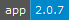

# Secure Configurations

[comment_badge_management_start]: <hidden__do_not_remove>
 

[comment_badge_management_end]: <hidden__do_not_remove>

a more simple approach to securing files with keybase (or any other folder that at rest is encrypted)

this project can be used in non nodejs projects (but still requires nodejs to run, aka you can backup/restore any type of files)

[Changelog](./CHANGELOG.md) | [Future Plans](./documentation/FUTURE.md) | [Known Issues](./documentation/KNOWN-ISSUES.md)

### Install

- Run `npm i -g secure-configurations`

### How to use

Check [Example Setup](https://github.com/voltsonic/secure-configurations-example) for a good introduction on how to use this library.

### Preview

No Updates.

New Backup File.

New Backup File with Diff.

Backup Run.

